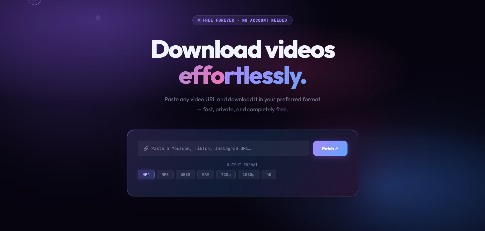

# 🎬 Velo — Video Downloader

> Paste any video URL and download it in your preferred format — fast, private, and completely free.


---



---

## ✨ Features

- **1000+ supported sites** — YouTube, TikTok, Instagram, Twitter/X, Vimeo, Reddit, Facebook, SoundCloud, Twitch, and more
- **Multiple formats** — `mp4`, `mp3`, `wav`, `webm`, `720p`, `1080p`, `4K`
- **Privacy-first** — no URLs, IPs, or downloads are stored or logged
- **Streams directly** — files are piped straight to your browser, never saved on the server
- **Clean UI** — glassmorphism dark interface, fully responsive

---

## 💻 Run Locally

### Prerequisites

- [Node.js](https://nodejs.org/) v18+
- Python 3.8+

```bash
# Install yt-dlp and ffmpeg
pip install yt-dlp
brew install ffmpeg          # macOS
sudo apt install ffmpeg      # Ubuntu/Debian

# Install Node deps & start
npm install
npm start
```

Open **http://localhost:3000**

---

## 📁 Project Structure

```
velo/
├── public/
│   ├── index.html       # Main HTML UI
│   ├── style.css        # UI styling
│   └── script.js        # Frontend logic
├── docs/
│   └── screenshot.png   # App screenshot (used in README)
├── server.js            # Express server + yt-dlp integration
├── package.json         # Node.js dependencies & scripts
├── railway.json         # Railway deployment config
├── nixpacks.toml        # Nixpacks build (installs yt-dlp + ffmpeg)
├── .gitignore
└── README.md
```

---

## 🔌 API Reference

### `GET /api/info?url=<video_url>`

Returns metadata for a video URL.

**Response:**
```json
{
  "title": "Video Title",
  "thumbnail": "https://...",
  "uploader": "Channel Name",
  "duration": "3:45"
}
```

### `GET /api/download?url=<video_url>&fmt=<format>`

Streams the file directly to the browser.

| `fmt` | Description |
|-------|-------------|
| `mp4` | Best MP4 up to 1080p (default) |
| `720p` | MP4 capped at 720p |
| `1080p` | MP4 capped at 1080p |
| `4k` | Best video up to 2160p |
| `webm` | WebM format |
| `mp3` | Audio only — MP3 |
| `wav` | Audio only — WAV |

---

## ⚙️ Environment Variables

| Variable | Default | Description |
|----------|---------|-------------|
| `PORT` | `3000` | Set automatically by Railway |

---

## 🛠️ Tech Stack

- **Backend:** Node.js, Express
- **Downloader:** [yt-dlp](https://github.com/yt-dlp/yt-dlp)
- **Media processing:** ffmpeg
- **Frontend:** Vanilla HTML/CSS/JS, Glassmorphism UI
- **Hosting:** [Railway](https://railway.app)

---

## 📝 License

MIT — use it, fork it, deploy it.
